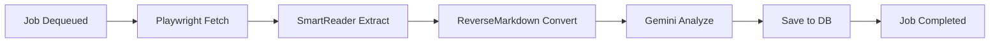

# Phase 3: 智能工坊 (The Workshop)

> **预估工时**: 6-8 小时
> **目标**: 实现浏览器采集、内容清洗与 AI 解构全流程

---

## 1. Playwright 生命周期管理

### 1.1 NuGet 包

```bash
dotnet add package Microsoft.Playwright --version 1.*
# 安装浏览器
pwsh src/backend/LexiFlow.Api/bin/Debug/net9.0/playwright.ps1 install chromium
```

### 1.2 BrowserLifecycleManager

```csharp
// Infrastructure/Browser/BrowserLifecycleManager.cs
public class BrowserLifecycleManager : IAsyncDisposable
{
    private readonly SemaphoreSlim _semaphore = new(1, 1);
    private IPlaywright? _playwright;
    private IBrowser? _browser;
    private int _taskCount;
    private const int MaxTasksBeforeRotation = 100;

    public async Task<IBrowserContext> CreateContextAsync()
    {
        await _semaphore.WaitAsync();
        try
        {
            if (_browser is null || _taskCount >= MaxTasksBeforeRotation)
            {
                await RotateBrowserAsync();
            }
            _taskCount++;
            return await _browser!.NewContextAsync(new()
            {
                UserAgent = "Mozilla/5.0 (compatible; LexiFlow/1.0)"
            });
        }
        finally
        {
            _semaphore.Release();
        }
    }

    private async Task RotateBrowserAsync()
    {
        if (_browser is not null) await _browser.CloseAsync();
        if (_playwright is null) _playwright = await Playwright.CreateAsync();
        _browser = await _playwright.Chromium.LaunchAsync(new()
        {
            Headless = true,
            Args = new[] { "--disable-gpu", "--no-sandbox" }
        });
        _taskCount = 0;
    }
}
```

### 1.3 关键设计点

- **上下文隔离**: 每个任务独立 `IBrowserContext`
- **定期轮换**: 100 个任务或 6 小时后重启浏览器
- **信号量控制**: 轮换期间阻塞新任务

---

## 2. 内容清洗管道

### 2.1 NuGet 包

```bash
dotnet add package SmartReader --version 0.*
dotnet add package ReverseMarkdown --version 4.*
```

### 2.2 ContentPipeline

```csharp
// Infrastructure/Content/ContentPipeline.cs
public class ContentPipeline
{
    public async Task<CleanedContent> ProcessAsync(string rawHtml, string sourceUrl)
    {
        // Step 1: SmartReader 提取正文
        var reader = new SmartReader.Reader(sourceUrl, rawHtml);
        var article = reader.GetArticle();

        if (!article.IsReadable)
            throw new ContentExtractionException("Unable to extract readable content");

        // Step 2: ReverseMarkdown 转换
        var converter = new ReverseMarkdown.Converter(new Config
        {
            RemoveComments = true,
            SmartHrefHandling = true
        });
        var markdown = converter.Convert(article.Content);

        return new CleanedContent
        {
            Title = article.Title,
            Author = article.Author,
            Markdown = markdown,
            WordCount = markdown.Split(' ', StringSplitOptions.RemoveEmptyEntries).Length
        };
    }
}
```

---

## 3. Gemini 3.0 Flash 集成

### 3.1 NuGet 包

```bash
dotnet add package Google.Cloud.AIPlatform.V1 --version 3.*
# 或使用新 SDK (如已发布)
dotnet add package Google.GenAI --version 1.*
```

### 3.2 CognitiveAnalyzer

```csharp
// Infrastructure/AI/CognitiveAnalyzer.cs
public class CognitiveAnalyzer
{
    private readonly GenerativeModel _model;

    public CognitiveAnalyzer(IConfiguration config)
    {
        var client = new GenerativeModelServiceClient();
        _model = new GenerativeModel(client, "models/gemini-3.0-flash-001");
    }

    public async Task<AnalysisResult> AnalyzeAsync(string markdown)
    {
        var request = new GenerateContentRequest
        {
            Contents = { new Content { Parts = { new Part { Text = markdown } } } },
            GenerationConfig = new GenerationConfig
            {
                ResponseMimeType = "application/json",
                Temperature = 0.2f
            },
            SystemInstruction = new Content { Parts = { new Part { Text = SystemPrompt } } }
        };

        var response = await _model.GenerateContentAsync(request);
        return JsonSerializer.Deserialize<AnalysisResult>(response.Text)!;
    }

    private const string SystemPrompt = """
        你是一个拥有20年经验的首席架构师，擅长透过现象看本质。
        分析以下文章，输出 JSON：
        {
          "summary": "核心摘要",
          "deep_logic": "深层逻辑分析",
          "blind_spots": "作者可能的盲点",
          "tech_stack": ["技术栈标签"],
          "critical_score": 1-10,
          "tags": ["语义标签"]
        }
        """;
}
```

---

## 4. 完整处理流程



---

## 5. 验证清单 (Verification Checklist)

- [ ] 提交 URL 后，浏览器成功抓取内容
- [ ] SmartReader 正确提取正文（排除广告/导航）
- [ ] Markdown 输出可读性良好
- [ ] Gemini 返回有效 JSON
- [ ] 分析结果正确存储到数据库
- [ ] 内存占用在 100 个任务后无明显增长

---

## 6. 产出物 (Deliverables)

| 文件                                                | 描述               |
| :-------------------------------------------------- | :----------------- |
| `Infrastructure/Browser/BrowserLifecycleManager.cs` | 浏览器生命周期管理 |
| `Infrastructure/Content/ContentPipeline.cs`         | 内容清洗管道       |
| `Infrastructure/AI/CognitiveAnalyzer.cs`            | Gemini 分析器      |
| `Services/JobProcessorService.cs`                   | 完整处理逻辑       |
